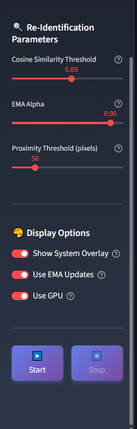

# TRIDENT AI Vision System

***A demo pipeline that combines YOLOv8 detection and OSNet person re-identification, wrapped in a sleek Streamlit web app. Instead of staring at benchmark scores like mAP or CMC, you can upload your own videos and see how re-ID works in action, frame by frame, ID by ID.***

<p align="center">

</p>

## Quick Start Guide

Clone the repo:
```
git clone https://github.com/rej0gam/trident-vision-demo.git
cd trident-vision-demo
```

Create and activate a Python environment:
```
python -m venv .venv
source .venv/bin/activate      # Mac/Linux
.venv\Scripts\activate         # Windows
```

Install dependencies:
```
pip install -r requirements.txt
```

Run the App
```
streamlit run st_app.py
```

> - Your browser will open automatically. Upload a .mp4 (or .avi/.mov/.mkv) and hit Start.
> - If you don’t have your own video, try the included sample in src/data/sample/video1.mp4.

## Project Structure
```
trident-reid-demo/
│── st_app.py
│── src/
| └── data
|   └── gifs
|     └── demo_preview.gif
|     └── demo_reid.gif
|   └── models
|     └── osnet.pth.tar-10
|     └── yolov8n.pt
|   └── pics
|     └── activity_log_01.png
|     └── activity_log_02.png
|     └── side_bar_01.png
|     └── side_bar_02.png
|     └── video_playback_no_loaded_video.png
|     └── video_playback_with_loaded_video.png
|   └── sample
|     └── video1.mp4
│ └── main.py
│── requirements.txt
│── README.md
```

## Why this project?

Most re-ID papers flex numbers like 99% accuracy. But here’s the catch:

>- If the system mislabels 10 frames in a 1,500-frame video, that’s just a 0.66% error rate. On paper, that’s 99.4% accuracy. To a human watching the video, it looks like the system “broke” the moment it shows a wrong ID. This demo exists to bridge that gap, so you can experience both the strengths and the imperfections of real-world re-ID.

## Features

- YOLOv8 Detection – fast, lightweight, person-only detection.

- OSNet Re-ID – assigns consistent IDs across frames, with EMA feature smoothing.

- Occlusion Handling – flags overlaps between people.

- Reacquisition Logic – recovers identities after long disappearances.

- System Overlay – real-time CPU/GPU usage stats.

- Streamlit UI – upload videos, tune parameters, and run experiments interactively.

## UI Overview

### Sidebar Configuration

<p align="center">
    
    
</p>

The sidebar allows you to upload videos, adjust detection & ReID parameters, and control processing.


### Video Playback & Metrics

<p align="center">
    
    
</p>
This is when the user didn't upload any video yet (left). Shows live video processing with tracked IDs, FPS, and frame progress. (Right)


### Activity Logs

<p align="center">
    
    
</p>
Displays system logs in real-time for occlusion, reacquisition, and ID tracking events.

### Video Demo

<p align="center">
    
</p>

Before running ReID, users can preview their uploaded video.
In the GIF example above, the system is simply showing the uploaded video while allowing you to adjust parameters in the configuration sidebar.

> ***Note***: Once you press Play, the parameters become locked. This is due to Streamlit’s event loop: each frame is processed in a continuous loop, which prevents changes from being applied mid-run. If parameters were modified while the loop was active, Streamlit would either throw an error or restart the process.

I intentionally did not implement an automatic restart when parameters are changed, since my goal is to eventually support real-time parameter updates (including switching models mid-operation). For now, disabling parameters during playback provides the most stable and user-friendly experience.

<p align="center">

</p>

This is where the system begins live person re-identification. Each detected individual is assigned a unique ID.

Here’s how the pipeline works for each frame:
1. The frame is captured.
2. It is passed to a YOLOv8 detector, which filters for the person class.
3. Each detected person is cropped and fed into an OSNet model for re-identification.
4. The system updates or creates an ID entry for that person.

To ensure stable identities, the system uses Exponential Moving Average (EMA) to update feature vectors instead of simple averaging. EMA helps smooth out sudden changes, keeping IDs consistent across frames.

> In the Activity Log, you’ll also notice occlusion detection. This is implemented by checking the Intersection over Union (IoU) between detected bounding boxes. If the IoU exceeds the threshold set in the parameters, the system flags an occlusion. While more advanced occlusion and depth estimation models exist, they tend to be GPU-intensive. This implementation balances efficiency with functionality.

## Usage

Run the Streamlit app:
1. Upload a video file (.mp4, .avi, .mov, .mkv).
2. You can leave the parameters as they are, these are predefined parameters for the models for best use. Keep note that adjusting these parameters blindly will cause the reid to mis-identify objects in the scene.
3. Click Start to begin processing.
4. Watch real-time logs, FPS metrics, and tracked IDs update live.

## Parameters Explained

>***Notes***

>- **These settings don’t completely change how the system works; rather, they make subtle adjustments that help fine-tune the results. For instance, lowering the cosine similarity threshold doesn’t suddenly break identification. Whether it’s set to 0.1 or 0.9, the system can still recognize people correctly if the model itself is confident enough, say, with a high confidence score around 0.95. The real challenge happens when there are several people in the same scene wearing very similar clothes. If the only differences are in details like hair, a face, or a bag, their features may look so alike that the system assigns them the same ID. Imagine their similarity scores falling between 0.65 and 0.75. If your threshold is also set at 0.65, the system will likely treat them as the same person, even if they’re not. Raising the threshold makes the system stricter, which helps reduce this problem.Because no two videos are the same, different lighting, clothing styles, camera resolutions, and crowd sizes, the settings are left adjustable. This way, you can adapt the system to match the conditions of your own videos instead of relying on a one-size-fits-all setup.**

>- **This demo shows how a 2D CNN can perform in realistic settings. The system uses techniques like EMA updating, filtering, and simple preprocessing to boost reliability. Unlike benchmarks with fixed test videos, this demo lets users upload their own clips for true zero-shot evaluation and even then, the model reaches 80–95% accuracy. The goal here isn’t just numbers on a slide, but to visualize what those numbers mean in practice, and to highlight both the strengths and the nuances of real-world re-identification.**

1. NMS Threshold – Controls how much overlap is allowed between detected people.

- Lower value = the system will try to detect more people, even if their boxes overlap.

- Higher value = fewer boxes, but cleaner results.

2. IoU Threshold – Decides how sensitive the system is when checking if two people are blocking/overlapping each other (occlusion).

- Lower value = system will say “occlusion” more often.

- Higher value = only obvious overlaps count as occlusion.

3. Cosine Similarity – Controls how strict the system is when deciding if two images belong to the same person.

- Higher value = very strict (less chance of mixing up people, but might miss matches).

- Lower value = more flexible (easier to match, but might confuse people who look alike).

4. EMA Alpha – A “smoothing” setting that helps the system keep a person’s ID stable over time.

- Higher value = IDs update slowly but stay very stable.

- Lower value = IDs update quickly but may switch more often.

5. Proximity Threshold – How close two detections must be (in pixels) for the system to treat them as the same person when reappearing.

- Smaller value = stricter (system only reconnects if very close).

- Larger value = more forgiving (system reconnects IDs from farther away).

6. GPU Option – If you have a graphics card (GPU), the system will use it to run faster. You can also force it to use the CPU instead (slower but still works).

# Disclaimer

This project is designed for local execution on a machine with a proper GPU.
It is not optimized for cloud deployment or lightweight environments (e.g., free hosting tiers).
Expect significant compute requirements for real-time performance.

If you don’t have a GPU, the system will still run on CPU, but much slower.

## License

This project is licensed under the GPLv3 License

## Acknowledgements

This project builds on the amazing work of several open-source communities and researchers:

[Ultralytics YOLOv8](https://github.com/ultralytics/ultralytics)   |   [TorchReID](https://github.com/KaiyangZhou/deep-person-reid)   |   [Streamlit](https://streamlit.io/)   |   [GPUtil](https://github.com/anderskm/gputil)   |  [psutil](https://github.com/giampaolo/psutil)   |   [pynvml](https://pypi.org/project/pynvml/)

## Citation

If you use this demo in your research, please consider citing this repository and the original works that made it possible
```
@misc{trident2025,
  author       = {Rejey Gammad},
  title        = {TRIDENT AI Vision System: A Demo of YOLOv8 + OSNet for Person Re-Identification},
  year         = {2025},
  publisher    = {GitHub},
  journal      = {GitHub repository},
  howpublished = {\url{https://github.com/rej0gam/trident-vision-demo}}
}

@article{yolov8,
  title   = {Ultralytics YOLOv8: Real-Time Object Detection},
  author  = {Glenn Jocher et al.},
  year    = {2023},
  url     = {https://github.com/ultralytics/ultralytics}
}

@inproceedings{zhou2019osnet,
  title     = {Omni-Scale Feature Learning for Person Re-Identification},
  author    = {Kaiyang Zhou and Xiangyu Zhang and Zhen Wei and Chen Change Loy},
  booktitle = {Proceedings of the IEEE/CVF International Conference on Computer Vision (ICCV)},
  year      = {2019}
}

@misc{streamlit,
  title   = {Streamlit: Turn Python Scripts into Data Apps},
  author  = {Streamlit Inc.},
  year    = {2019},
  url     = {https://streamlit.io/}
}

```

